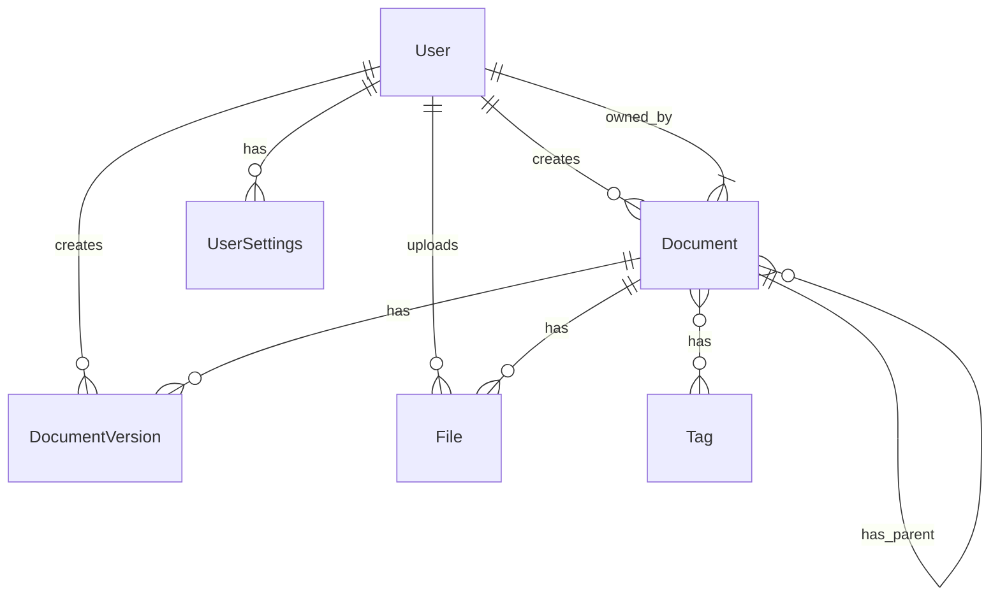

# Database Schema Design

## Overview

This document describes the database schema design for the DocMind system. The system uses PostgreSQL as the primary database and implements features such as user management, document management, version control, and tagging system.

## Entity Relationship Diagram



Table Structures
Users Table
Stores user information and authentication details.

```sql
CREATE TABLE users (
    id SERIAL PRIMARY KEY,
    username VARCHAR(32) NOT NULL UNIQUE,
    password VARCHAR(255) NOT NULL,
    email VARCHAR(128) NOT NULL UNIQUE,
    full_name VARCHAR(128) NOT NULL,
    bio VARCHAR(256),
    role VARCHAR(20) NOT NULL DEFAULT 'user',
    status VARCHAR(20) NOT NULL DEFAULT 'active',
    last_login TIMESTAMP,
    created_at TIMESTAMP NOT NULL DEFAULT CURRENT_TIMESTAMP,
    updated_at TIMESTAMP NOT NULL DEFAULT CURRENT_TIMESTAMP,
    deleted_at TIMESTAMP
);
```

User Settings Table
Stores user preferences and settings.

```sql
CREATE TABLE user_settings (
    id SERIAL PRIMARY KEY,
    user_id INTEGER NOT NULL UNIQUE,
    theme VARCHAR(20) DEFAULT 'light',
    language VARCHAR(10) DEFAULT 'en',
    notifications BOOLEAN DEFAULT true,
    created_at TIMESTAMP NOT NULL DEFAULT CURRENT_TIMESTAMP,
    updated_at TIMESTAMP NOT NULL DEFAULT CURRENT_TIMESTAMP,
    deleted_at TIMESTAMP,
    FOREIGN KEY (user_id) REFERENCES users(id)
);
```

Documents Table
Stores document content and metadata.

```sql
CREATE TABLE documents (
    id SERIAL PRIMARY KEY,
    title VARCHAR(255) NOT NULL,
    content TEXT,
    version INTEGER DEFAULT 1,
    status VARCHAR(20) DEFAULT 'draft',
    creator_id INTEGER NOT NULL,
    parent_id INTEGER,
    path VARCHAR(255),
    created_at TIMESTAMP NOT NULL DEFAULT CURRENT_TIMESTAMP,
    updated_at TIMESTAMP NOT NULL DEFAULT CURRENT_TIMESTAMP,
    deleted_at TIMESTAMP,
    FOREIGN KEY (creator_id) REFERENCES users(id),
    FOREIGN KEY (parent_id) REFERENCES documents(id)
);
```

Document Versions Table
Stores document version history.

```sql
CREATE TABLE document_versions (
    id SERIAL PRIMARY KEY,
    document_id INTEGER NOT NULL,
    version INTEGER NOT NULL,
    title VARCHAR(255) NOT NULL,
    content TEXT,
    created_by INTEGER NOT NULL,
    created_at TIMESTAMP NOT NULL DEFAULT CURRENT_TIMESTAMP,
    FOREIGN KEY (document_id) REFERENCES documents(id),
    FOREIGN KEY (created_by) REFERENCES users(id)
);

```

Tags Table
Stores document tags.

```sql
CREATE TABLE tags (
    id SERIAL PRIMARY KEY,
    name VARCHAR(50) NOT NULL UNIQUE,
    created_at TIMESTAMP NOT NULL DEFAULT CURRENT_TIMESTAMP,
    updated_at TIMESTAMP NOT NULL DEFAULT CURRENT_TIMESTAMP,
    deleted_at TIMESTAMP
);
```

Document Tags Table
Manages many-to-many relationships between documents and tags.

```sql
CREATE TABLE document_tags (
    document_id INTEGER NOT NULL,
    tag_id INTEGER NOT NULL,
    PRIMARY KEY (document_id, tag_id),
    FOREIGN KEY (document_id) REFERENCES documents(id),
    FOREIGN KEY (tag_id) REFERENCES tags(id)
);
```

## Files Table
Stores file metadata and upload information.

```sql
CREATE TABLE files (
    id SERIAL PRIMARY KEY,
    original_name VARCHAR(255) NOT NULL,
    storage_name VARCHAR(255) NOT NULL UNIQUE,
    path VARCHAR(512) NOT NULL,
    size BIGINT NOT NULL,
    content_type VARCHAR(128),
    uploader_id INTEGER NOT NULL,
    document_id INTEGER,
    created_at TIMESTAMP NOT NULL DEFAULT CURRENT_TIMESTAMP,
    updated_at TIMESTAMP NOT NULL DEFAULT CURRENT_TIMESTAMP,
    deleted_at TIMESTAMP,
    FOREIGN KEY (uploader_id) REFERENCES users(id),
    FOREIGN KEY (document_id) REFERENCES documents(id)
);
```

## Table Relationships

1. Files and Users:
   - Each file must have an uploader (user)
   - One user can upload many files
   - Relationship enforced by `uploader_id` foreign key

2. Files and Documents:
   - Files can optionally be associated with a document
   - One document can have multiple files
   - Relationship enforced by `document_id` foreign key

## Key Features

1. File Storage:
   - Original filename preservation (`original_name`)
   - Unique storage name to prevent conflicts (`storage_name`)
   - Full file path for retrieval (`path`)
   - File size tracking (`size`)
   - Content type recording (`content_type`)

2. Relationships:
   - User tracking through `uploader_id`
   - Optional document association through `document_id`

3. Timestamps:
   - Creation time tracking
   - Update time tracking
   - Soft delete support